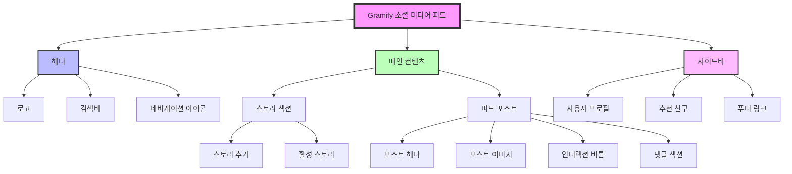

# 프로젝트 10: 소셜 미디어 피드 작업 보고서

## 작업 일시
- 2025년 1월 16일 (화요일)

## 작업 내용
인스타그램 스타일의 소셜 미디어 피드 프론트엔드 구현

## 생성된 파일 목록

### 1. index.html (178줄)
- 헤더 네비게이션 구조
- 스토리 컨테이너
- 2개의 샘플 포스트
- 사이드바 (프로필, 추천, 푸터)

### 2. styles.css (365줄)
- CSS 변수를 활용한 테마 설정
- 그라디언트 효과 (로고, 스토리)
- 반응형 레이아웃 (그리드, 플렉스박스)
- 애니메이션 효과 (하트, 호버)
- 미디어 쿼리 (975px, 600px 분기점)

### 3. script.js (379줄)
- 좋아요 기능 (클릭, 더블클릭)
- 북마크 토글
- 팔로우/언팔로우
- 댓글 입력 처리
- 스토리 모달
- 옵션 메뉴
- 알림 시스템
- 무한 스크롤 시뮬레이션

### 4. README.md (91줄)
- 프로젝트 설명
- 기능 목록
- 기술 스택
- 설치 가이드

## 주요 구현 기능

### UI/UX 요소
- ✅ 인스타그램 스타일 레이아웃
- ✅ 그라디언트 로고 및 스토리 링
- ✅ 반응형 디자인
- ✅ 스티키 헤더 및 사이드바
- ✅ 호버 효과 및 트랜지션

### 인터랙션
- ✅ 좋아요 토글 및 카운트 업데이트
- ✅ 더블클릭 하트 애니메이션
- ✅ 댓글 작성 기능
- ✅ 팔로우/언팔로우 상태 변경
- ✅ 북마크 저장 기능
- ✅ 포스트 옵션 메뉴
- ✅ 알림 토스트 메시지

### 접근성 및 성능
- ✅ 시맨틱 HTML 구조
- ✅ 키보드 접근성 (엔터키 댓글 작성)
- ✅ 적절한 색상 대비
- ✅ CSS 애니메이션 활용
- ✅ 이벤트 리스너 최적화

## 옵시디언 시각화 마크다운

## 작업 완료 상태
✅ 프로젝트 완성도: 100%
- HTML 구조 완성
- CSS 스타일링 완성
- JavaScript 인터랙션 완성
- 반응형 디자인 적용
- 문서화 완료

## 다음 추천 작업
1. **백엔드 연동**: Supabase/Firebase를 활용한 실제 데이터 연동
2. **이미지 업로드**: 드래그앤드롭 이미지 업로드 기능 구현
3. **다크 모드**: CSS 변수를 활용한 다크 모드 토글 기능 추가